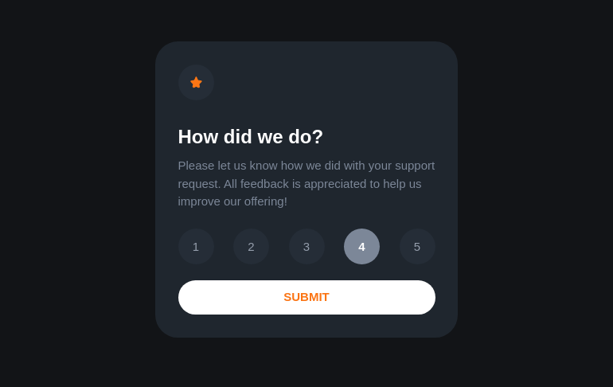

# Interactive rating component solution - Frontend Mentor

This is a solution to the [Interactive rating component challenge on Frontend Mentor](https://www.frontendmentor.io/challenges/interactive-rating-component-koxpeBUmI).

## Table of contents
as In
- [Overview](#overview)
  - [The challenge](#the-challenge)
  - [Screenshot](#screenshot)
  - [Links](#links)
- [My process](#my-process)
  - [Built with](#built-with)
  - [What I learned](#what-i-learned)
  - [Useful resources](#useful-resources)
- [Author](#author)

## Overview

### The challenge

Users should be able to:

- View the optimal layout for the app depending on their device's screen size
- See hover states for all interactive elements on the page
- Select and submit a number rating
- See the "Thank you" card state after submitting a rating

### Screenshot

### Links

- Solution URL: [on Github](https://github.com/agnes978/interactive-rating-component-challenge/)
- Live Site URL: [Add live site URL here](https://your-live-site-url.com)

## My process

### Built with

- Semantic HTML5 markup
- CSS custom properties
- Flexbox
- Vanilla JS 

### What I learned

in CSS
- pseudo classes states :checked, :selected, :hover, :active, :focus and differences between the last two.
- child combinator: >
- sibling combinators: ~ and +
- transitions
- transform: translate() 
- how to organize CSS declarations

in JS
- for...in
- DOM manipulation, toggle()

### Continued development

Use this section to outline areas that you want to continue focusing on in future projects. These could be concepts you're still not completely comfortable with or techniques you found useful that you want to refine and perfect.

### Useful resources

- Website - [Radio button Javascript tutorial](https://www.javascripttutorial.net/javascript-dom/javascript-radio-button/)

## Author

- Agnes978 - [on github](https://github.com/agnes978)
- Frontend Mentor - [@agnes978](https://www.frontendmentor.io/profile/agnes978)

